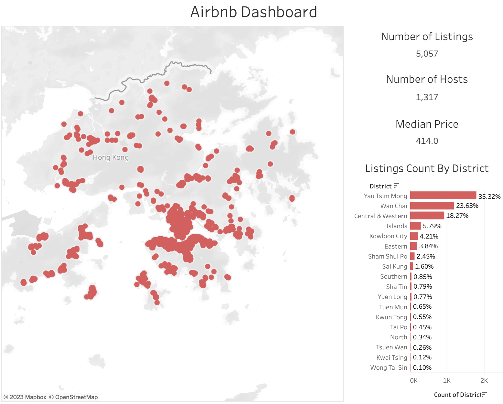
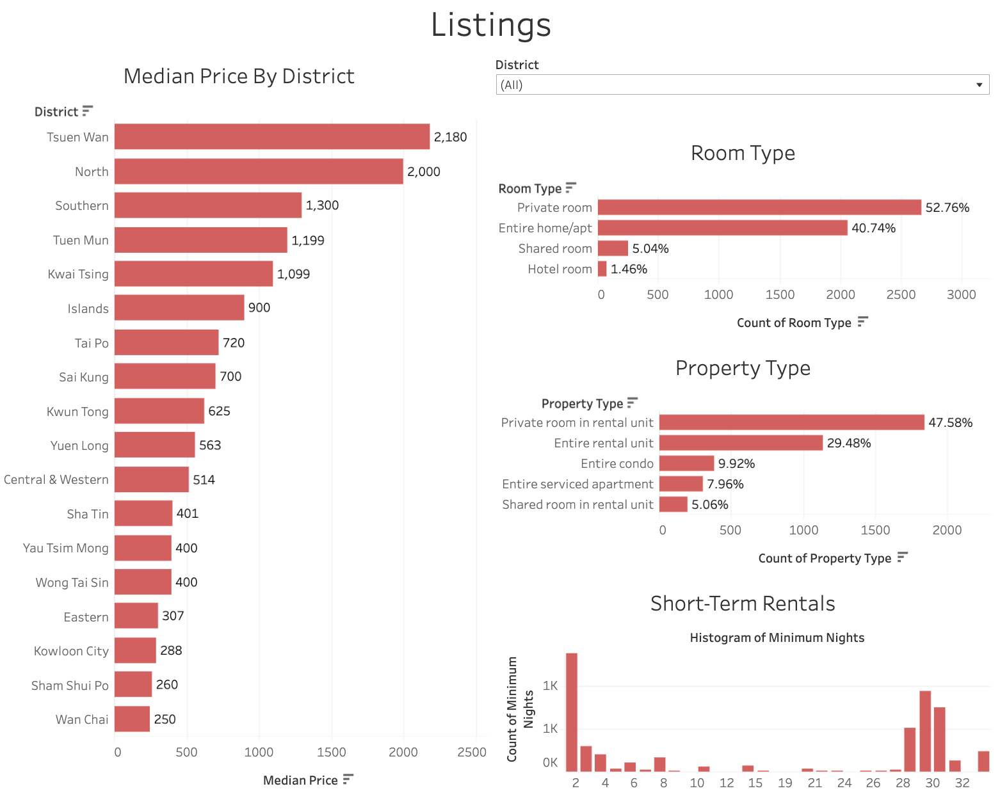
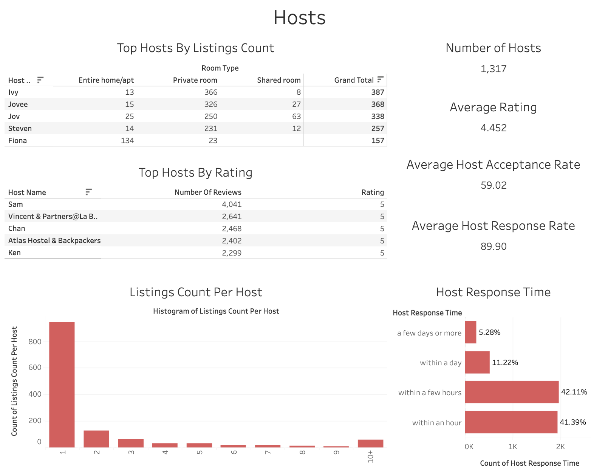

# Airbnb Dashboard

In this project, I created three Tableau dashboards to visualize the Airbnb listings data obtained from [Inside Airbnb](http://insideairbnb.com/get-the-data/) on Jan 4, 2022. The dashboards are published to [Tableau Public](https://public.tableau.com/views/dashboard_16728445630440/Dashboard3?:language=en-US&:display_count=n&:origin=viz_share_link).

The first dashboard shows where the listings are concentrated at. It can be observed that almost half of the listings are located at the Yau Tsim Mong district.

The second dashboard shows that the listings in Tsuen Wan have the highest median price. The most common room type is private room, while the most common property type is private room in rental unit. According to the Hong Kong Hotel and Guest House Accommodation Ordinance [any premise that offers sleeping accommodations for fewer than 28 days must be licensed by the office of Licensing Authority under the Home Affairs Department. By looking at the "minimum nights" setting for listings, we can see if the market has shifted to longer-term stays.

The third dashboard displays the top 5 hosts based on listings count and average rating. It also provides how well the hosts are doing on average in terms of rating, accpetance rate, response rate and response time. Finally, there is a histogram of the number of listings per host. The majority hosts only have one listing. A small number of hosts have 10+ listings. They are most likely running a business.

